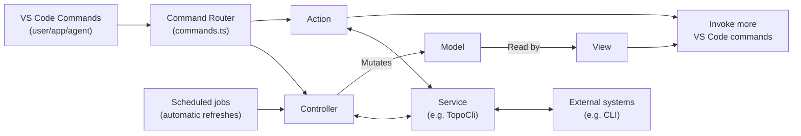

# Codebase Architecture

As a VS Code extension, interaction is mostly done via [commands](https://code.visualstudio.com/api/extension-guides/command). Our responsibility is to handle commands from the user, their agent(s) or other parts of the extension and do something useful.

There are two primary types of command - ones that need to directly update the UI by querying the outside world, and those that are side-effect only that are mostly designed to surface useful operations the user may want to perform in VS Code. The former type of commands are handled by **controllers**, while the latter are handled by **actions**. Both **controllers** and **actions** can call **services** to talk to external systems.

At the top-level of the extension we create a command registry which is responsible for routing VS Code command strings to action/controller command handlers. At this same level, the extension has the option to register any method of invoking command handlers that it needs. For example, we run a periodic refresh event of certain target state every few seconds. We register such systems alongside the command router than making use of it for type safety guarantees and to skip the VS Code plumbing where it is unneeded.

## Actions

Actions are standalone operations that users may want to perform that we surface as commands. Commands can be invoked by a variety of means including the command palette, tree view buttons, agents or custom task definitions.

The important distinction for us is that actions are command handlers that do not need to directly update the state of UI. This means they're usually side-effect-like operations like launching terminals or displaying the output of a given topo command in an editor tab. However, they can invoke other commands which may mutate the UI if required.

## Services

Services wrap external systems and persistence, such as the Topo CLI. Controllers and actions call services; services must not mutate models, render views, or register commands.

## MVC

MVC; model, view controller is a common pattern for UI applications and the approach we take in this extension to manipulate the UI. The intention behind moving to an MVC architecture is to keep data flowing strictly in one direction, making the application easier to reason about and change. Each component, as well as full concrete example of how they interact with eachother, is described below.

### Models

Models are a representation of the current state of the world. They are simple data containers that emit events when mutated. They are mutated by controllers and read from by views.

Models must only ever be mutated by controllers, never directly by views.

### Views

Views take a reference to a model (or models) and render them to the UI in some way. As a VS Code extension, this boils down to working with various vscode APIs to do things like construct status bar items or building tree views in the sidebar that visualize the state of our models.

Views subscribe to the events emitted by models to trigger re-renders and can optionally render data from multiple models if required.

Some views may need to invoke mutations of the model as a result of user interaction. VS Code mostly handles this via [commands](https://code.visualstudio.com/api/extension-guides/command) (discussed more below). While commands should be favoured for controller invocations to keep a consistent API surface, rarely, commands may not be applicable for a given UI. For example, if you create a webview containing a list of targets where clicking on one selects it (don't do this). In this case it's acceptable to pass a reference to the relevant controller to the view and perform the mutation there. Do not use the result of the mutation, wait for the model get updated and trigger a re-render.

### Controllers

Controllers are the top-level orchestrators for UI state. They call services to query or mutate the outside world and convert the result into domain objects that can be passed to models.

Our UIs need to render these domain objects in three distinct states:

- Loading - with a placeholder (note: the placeholder is often the previously loaded data to avoid visual jitter)
- Loaded - with the freshly loaded domain object
- Error - with some data related to the error to render

Since the controller owns the async orchestration around service calls, managing error and loading states is solely its responsibility. Furthermore, it's a good idea to only mutate each model from one controller to make async orchestration easier by virtue of centralization of control.
